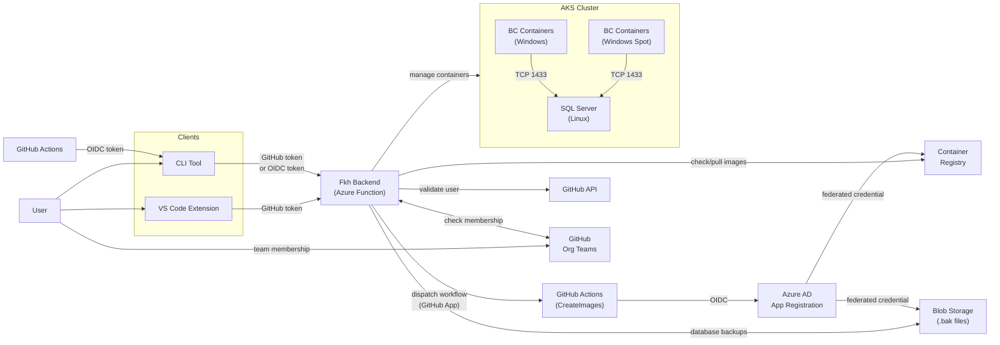
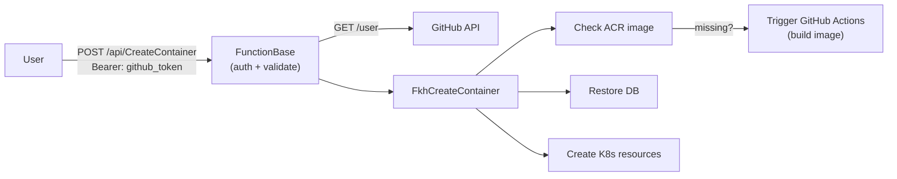
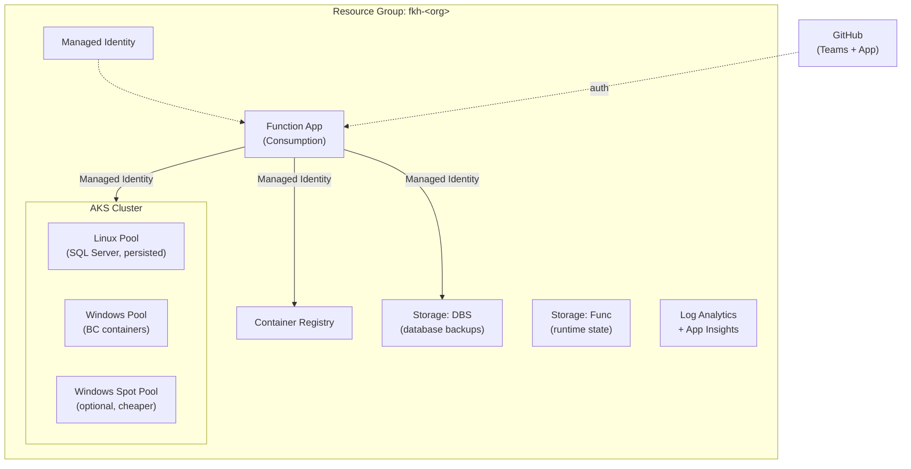
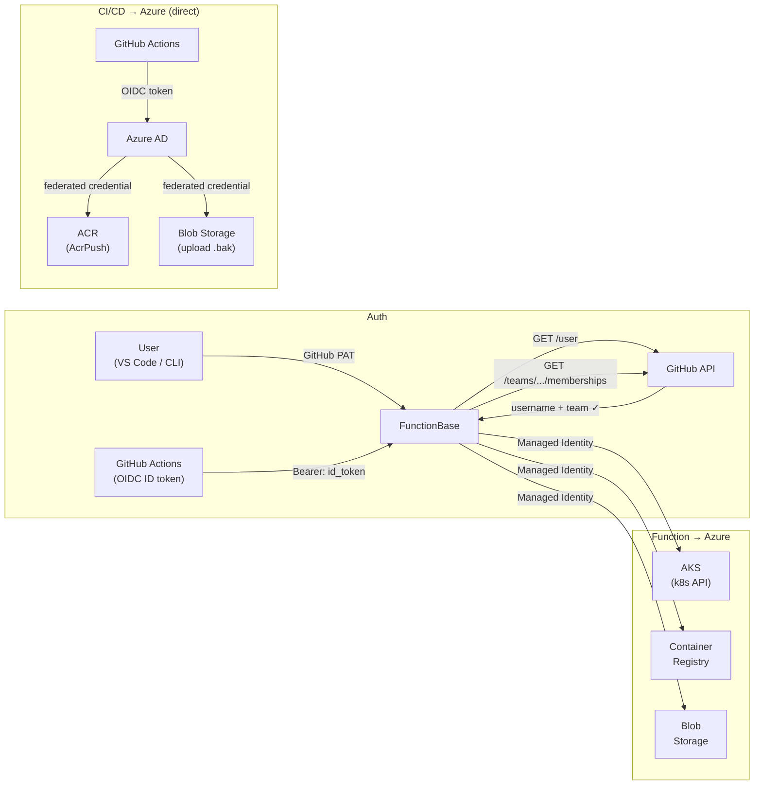
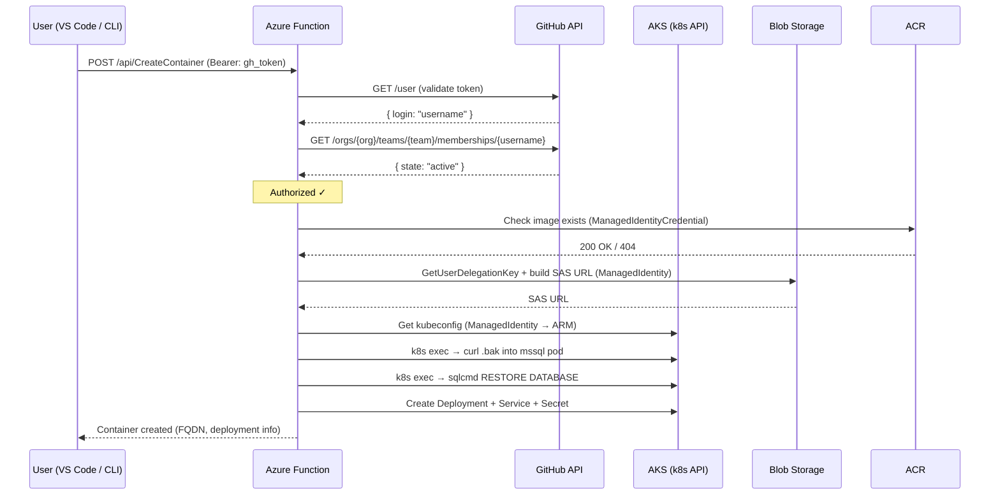
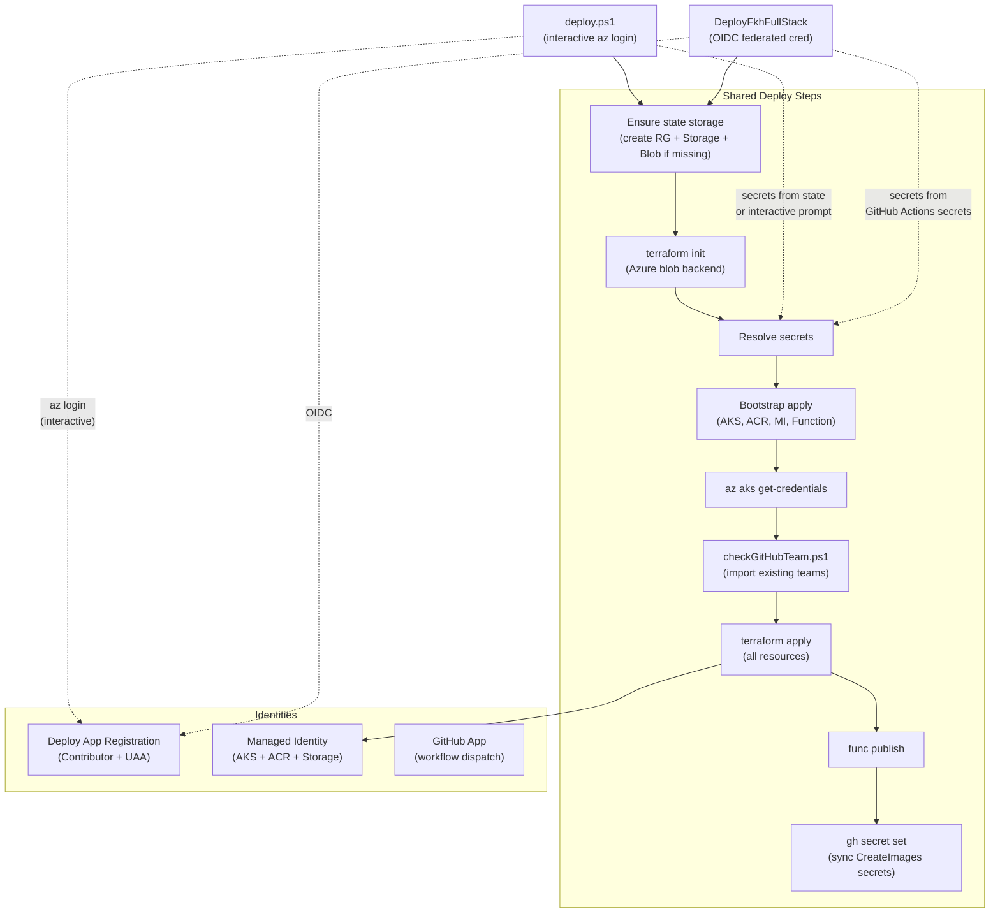

# Fkh Architecture

Fkh is a **GitHub-authenticated AKS container provisioner** that allows authorized GitHub team members to create on-demand Business Central environments on Azure Kubernetes Service — directly from VS Code or a CLI — without requiring Azure credentials.

## High-Level Overview



## Request Flow



## Infrastructure Layout



## Component Descriptions

### User Interfaces

| Component | Path | Description |
|-----------|------|-------------|
| **VS Code Extension** | `fkh-vsix/` | Registers commands to create/remove containers. Uses VS Code's built-in GitHub auth to obtain a Bearer token and calls the Function App API. Fetches the function catalog for dynamic parameter prompts. Auto-detects public IP for SQL access. Parameter defaults can be set via `fkh.<Function>.<param>` settings. |
| **CLI Tool** | `fkh-cli/` | Standalone .NET executable (`fkh.exe`). Authenticates via `--oidcToken` (GitHub Actions OIDC), `OIDC_TOKEN` env var, `GH_TOKEN`, `GITHUB_TOKEN`, or `gh auth token`. Interactively prompts for parameters with masked password input. Auto-detects public IP for SQL access. |

### Azure Functions Backend

| Component | Path | Description |
|-----------|------|-------------|
| **FunctionBase** | `fkh-backend/FunctionBase.cs` | Base class for all HTTP functions. Extracts Bearer token, validates it against GitHub API (PAT) or GitHub Actions OIDC (JWT), checks team membership, parses and validates parameters against the function catalog, and injects the GitHub username. Includes brute-force protection (IP blocking after 3 failed attempts within 5 minutes). |
| **GitHubAuthService** | `fkh-backend/Services/GitHubAuthService.cs` | Calls `GET /user` and `GET /orgs/{org}/teams/{team}/memberships/{username}` to authenticate and authorize requests. Allowed org/team pairs loaded from `ALLOWED_ORG_TEAMS` env var. |
| **GitHubOidcService** | `fkh-backend/Services/GitHubOidcService.cs` | Validates GitHub Actions OIDC JWTs against GitHub's OpenID Connect discovery endpoint. Checks the `repository` claim against the `ALLOWED_OIDC_REPOS` allow-list. OIDC callers are granted admin privileges. |
| **GitHubAppTokenService** | `fkh-backend/Services/GitHubAppTokenService.cs` | Creates JWTs signed with the GitHub App private key, exchanges for installation access tokens, and dispatches the `createImages` workflow when an image is missing from ACR. |
| **FkhCreateContainer** | `fkh-backend/Services/FkhCreateContainer.cs` | Orchestrates container creation: ACR image check → database backup SAS URL → k8s exec to download and restore database → create K8s deployment, service, and secret. |
| **FkhRemoveContainer** | `fkh-backend/Services/FkhRemoveContainer.cs` | Removes Kubernetes resources (deployment, service, secret) and drops the database for a given container. |
| **FkhScaleContainer** | `fkh-backend/Services/FkhScaleContainer.cs` | Scales a container's deployment: StopContainer sets replicas to 0, StartContainer sets replicas to 1. Database is preserved across stop/start. |
| **FkhListVMs** | `fkh-backend/Services/FkhListVMs.cs` | Lists VMs filtered by user (or all). Shows status, image, web client URL, and CPU/memory usage via the metrics API. |
| **FkhAllowSqlAccess** | `fkh-backend/Services/FkhAllowSqlAccess.cs` | Manages temporary external SQL Server access. Creates a per-user LoadBalancer service (IP-restricted via `loadBalancerSourceRanges`) and a NetworkPolicy allowing the user's IP through to the MSSQL pod. Auto-revokes expired grants via the timer-triggered AutoStop function. |
| **FkhServiceBase** | `fkh-backend/Services/FkhServiceBase.cs` | Shared base class with AKS/ACR/Storage config, Kubernetes client creation via managed identity, and k8s exec helpers (`FindMssqlPodAsync`, `ExecInMssqlPodAsync`). |

### Infrastructure (Terraform)

| Resource | File | Description |
|----------|------|-------------|
| **AKS Cluster** | `main.tf` | Linux system pool (1× D2s_v3) + Windows autoscale pool (0–10 nodes). Azure CNI overlay networking. |
| **Function App** | `function.tf` | Windows Consumption (Y1) plan. Isolated .NET 8 worker. All config injected via app settings. |
| **SQL Server** | `kubernetes.tf` | `mssql/server:2022-latest` on Linux pod with 128 Gi Premium SSD PVC. ClusterIP service on port 1433. Network policy restricts ingress to `app-type: windows-servicetier` pods. External access can be temporarily granted per-user via `AllowSqlAccess`. |
| **ACR** | `acr.tf` | Basic SKU. AKS kubelet identity gets `AcrPull`; GitHub Actions federated identity gets `AcrPush`. |
| **Managed Identity** | `identity.tf` | User-assigned identity with AKS Contributor + Storage Blob Data Contributor roles. Federated credential for GitHub Actions OIDC. |
| **Storage (DBS)** | `function.tf` | `fkh{org}dbs` — holds database backup blobs in a `cronus` container, keyed by image tag. |
| **Storage (Func)** | `function.tf` | `fkh{org}func` — Azure Functions runtime state (queues, tables). |
| **GitHub Team** | `github.tf` | Manages the authorized team within the GitHub organization. |
| **Monitoring** | `monitoring.tf` | Log Analytics workspace (30-day retention) + Application Insights for function telemetry. |

### GitHub Actions

| Workflow | Trigger | Description |
|----------|---------|-------------|
| **CreateImages** | `workflow_dispatch` (artifactUrls) | Downloads BC artifacts via `BcContainerHelper`, extracts and uploads the `.bak` database backup to blob storage, builds the container image with `New-BcImage`, and pushes to ACR. Authenticates to Azure via OIDC federated identity. |

## Authentication Flow

There are three authentication paths:

1. **User requests** — VS Code / CLI sends a GitHub PAT to the Function App, which validates it against GitHub API.
2. **GitHub Actions → Function App (OIDC)** — A GitHub Actions workflow authenticates to the Function App using an OIDC ID token. The Function App validates the token and checks the repository against the `ALLOWED_OIDC_REPOS` allow-list.
3. **GitHub Actions → Azure (OIDC)** — GitHub Actions authenticates directly to Azure AD via a federated credential to push images to ACR and upload database backups to Blob Storage.



### Detailed Sequence



## Container Creation Flow

1. **Image check** — Verify the requested BC image exists in ACR. If missing, trigger the `createImages` GitHub Actions workflow via the GitHub App and return an error asking the user to retry.
2. **Database backup** — Generate a 1-hour read-only SAS URL for the `.bak` blob in the DBS storage account.
3. **Database existence check** — K8s exec into the mssql pod and run `sqlcmd` to verify the database doesn't already exist.
4. **Database restore** — K8s exec to `curl` the backup into the pod, then `sqlcmd` to `RESTORE DATABASE` with `MOVE` clauses for data/log files.
5. **Kubernetes resources** — Create a Secret (admin password), a Deployment (Windows container with BC image and database env vars), and a LoadBalancer Service (public IP with Azure DNS label).
6. **Return** — FQDN (`{appName}.{region}.cloudapp.azure.com`), deployment name, and database name.

## SQL Access Flow

`AllowSqlAccess` grants temporary direct SQL Server access from a user's public IP:

1. **Create LoadBalancer service** — `mssql-ext-{username}` with `loadBalancerSourceRanges` set to the user's IP/32. Targets the mssql pod on port 1433.
2. **Create NetworkPolicy** — `mssql-allow-ip-{username}` with an ingress rule allowing the user's CIDR to reach the mssql pod on port 1433.
3. **Wait for external IP** — Polls the service status until Azure assigns a public IP (up to ~2.5 minutes).
4. **Return** — SQL endpoint (`{externalIp},1433`), allowed IP, and auto-revoke time.

Access is auto-revoked by the `AutoStop` timer function (runs every 30 minutes),
which checks for `fkh/sql-access-revoke-at` annotations on the services and
deletes expired resources. Users can also revoke access immediately via `RevokeSqlAccess`.

Each user can have only one active SQL access grant. Calling `AllowSqlAccess` again
replaces the existing grant (updating the allowed IP and extending the timer).

## Deployment

### Overview

There are two ways to deploy the infrastructure:

| Method | Script / Workflow | When to use |
|--------|-------------------|-------------|
| **Local deploy** | `terraform/deploy.ps1` | First-time setup, or full redeploy from a developer workstation |
| **Full deploy workflow** | `.github/workflows/DeployFkhFullStack.yml` | Same as `deploy.ps1` but runs as a GitHub Actions workflow (manual trigger) |
| **Backend-only workflow** | `.github/workflows/UpdateFkhBackEnd.yml` | Publish function code only — no Terraform changes |

Both the local script and the `DeployFkhFullStack` workflow perform the **same steps**. The workflow reimplements the `deploy.ps1` logic as individual workflow steps. The only differences are:

- **Authentication** — `deploy.ps1` uses an interactive `az login`; the workflow uses OIDC (federated credential on the Deploy App Registration).
- **Secrets** — `deploy.ps1` recovers secrets from Terraform state on re-deploys (or prompts interactively); the workflow gets them from GitHub Actions secrets.

### Deploy Steps

Both `deploy.ps1` and `DeployFkhFullStack` run the following steps in order:

- **Ensure state storage** — Idempotently creates a resource group (`fkh-<org>-state`), a storage account (`fkh<org>state`), and a `tfstate` blob container if they don't already exist. Grants `Storage Blob Data Contributor` on the state account (to the current user for `deploy.ps1`, to the OIDC service principal for the workflow).
- **Terraform init** — Initializes with the Azure blob backend (uses Azure AD auth, not storage keys).
- **Resolve secrets** — `deploy.ps1` reads `TF_VAR_sql_sa_password` and `TF_VAR_github_app_private_key` from existing Terraform state to avoid re-prompting, then interactively prompts for any still missing. The workflow receives them from GitHub Actions secrets (`SQL_SA_PASSWORD`, `GH_APP_PRIVATE_KEY`).
- **Bootstrap apply** — Targeted `terraform apply` for core Azure resources (resource group, AKS, ACR, storage accounts, function app, managed identity, federated credentials) so the Kubernetes provider can initialize.
- **Fetch AKS credentials** — Runs `az aks get-credentials` so subsequent steps can talk to the cluster.
- **Check / import GitHub teams** — Runs `checkGitHubTeam.ps1` to import existing GitHub teams into Terraform state, avoiding conflicts.
- **Full Terraform apply** — Applies all remaining resources (Kubernetes namespace, SQL Server pod, network policies, GitHub teams, monitoring).
- **Publish function code** — Runs `func azure functionapp publish` with the .NET isolated worker (`deploy.ps1` delegates to `deploy-functionupdate.ps1`).
- **Sync GitHub Actions secrets** — Uses `gh secret set` to push `AZURE_CLIENT_ID`, `AZURE_TENANT_ID`, `AZURE_SUBSCRIPTION_ID`, `ACR_LOGIN_SERVER`, and `DBS_STORAGE_ACCOUNT` to the repository for the `CreateImages` workflow.

### Organization Configuration (`.tfvars`)

Each organization has a file under `terraform/organizations/<org>.tfvars`. Copy `example.tfvars` as a starting point.

| Variable | Description |
|----------|-------------|
| `subscription_id` | Azure subscription to deploy into |
| `tenant_id` | Azure AD tenant ID |
| `location` | Azure region (e.g. `swedencentral`) |
| `org_name` | Short identifier used in resource names (`fkh-<org>-*`) |
| `github_org` | GitHub organization name (case-sensitive) |
| `github_repo` | Repository name (your fork of Fkh) |
| `github_team_name` | Team controlling user access (created if missing) |
| `github_team_members` | List of GitHub usernames to add to the team |
| `github_admin_team_name` | Team controlling admin access |
| `github_admin_team_members` | Admin usernames |
| `allowed_org_teams` | Org/team pairs the Function App accepts for user auth |
| `admin_org_teams` | Org/team pairs that grant admin privileges |
| `allowed_oidc_repos` | Repos allowed to call the Function App via GitHub Actions OIDC |
| `github_app_id` | GitHub App ID (triggers image builds) |
| `github_app_installation_id` | Installation ID of the GitHub App |
| `contact_email_for_letsencrypt` | Email for Let's Encrypt certificates |
| AKS sizing | `linux_vm_size`, `windows_vm_size`, `windows_min/max_node_count`, spot pool settings, `windows_overprovision`, `windows_prepull_images` |
| SQL | `sql_storage_size`, `namespace` |

**Secrets** (never committed to tfvars — set via environment variables):

| Environment Variable | Description |
|----------------------|-------------|
| `TF_VAR_github_token` | GitHub PAT with `admin:org` + `repo` + `read:org` scopes |
| `TF_VAR_sql_sa_password` | SA password for the SQL Server pod (≥ 8 characters) |
| `TF_VAR_github_app_private_key` | PEM-encoded private key of the GitHub App |

### App Registrations and Identities

There are two distinct identity mechanisms:

#### 1. Managed Identity (runtime — created by Terraform)

Terraform creates a **user-assigned managed identity** (`identity.tf`) that the Function App uses at runtime to access Azure resources. No credentials are stored — Azure handles authentication at the infrastructure level.

| Role Assignment | Scope | Purpose |
|-----------------|-------|---------|
| Azure Kubernetes Service Contributor | AKS cluster | Manage containers, exec into pods |
| Storage Blob Data Contributor | DBS storage account | Generate SAS URLs for database backups |
| AcrPush | Container Registry | Push images (used by GitHub Actions via federated credential) |
| Log Analytics Reader | Log Analytics workspace | Query image pull timestamps |

The same identity has a **federated credential for GitHub Actions OIDC** (`identity.tf`):

```
Issuer:   https://token.actions.githubusercontent.com
Subject:  repo:<org>/<repo>:ref:refs/heads/main
Audience: api://AzureADTokenExchange
```

This lets the `CreateImages` workflow authenticate to Azure as the managed identity (passwordless) to push images to ACR and upload database backups to Blob Storage.

#### 2. Deploy App Registration (created manually)

For the **deploy workflows** (`DeployFkhFullStack`, `UpdateFkhBackEnd`), you must create a separate Azure AD App Registration with:

- A **federated credential** for GitHub Actions OIDC:
  ```
  Issuer:   https://token.actions.githubusercontent.com
  Subject:  repo:<org>/<repo>:ref:refs/heads/main
  Audience: api://AzureADTokenExchange
  ```
- **Role assignments** on the Azure subscription:
  - `Contributor` — create and manage all resources
  - `User Access Administrator` — create role assignments for managed identities

This App Registration's credentials are stored as GitHub Actions secrets (`AZURE_DEPLOY_CLIENT_ID`, `AZURE_DEPLOY_TENANT_ID`, `AZURE_DEPLOY_SUBSCRIPTION_ID`).

### GitHub App

A **GitHub App** is required to trigger image-build workflows when a user requests a BC version whose image doesn't exist in ACR yet. The Function App uses the GitHub App to dispatch the `CreateImages` workflow.

Configuration:

| Setting | Where it goes |
|---------|---------------|
| App ID | `github_app_id` in `.tfvars` |
| Installation ID | `github_app_installation_id` in `.tfvars` |
| Private key (.pem) | `TF_VAR_github_app_private_key` env var → stored in Function App settings as `GITHUB_APP_PRIVATE_KEY` |

The `GitHubAppTokenService` in the backend creates short-lived JWTs signed with the private key, exchanges them for installation access tokens, and uses those to call `POST /repos/{owner}/{repo}/actions/workflows/CreateImages.yml/dispatches`.

### GitHub Actions Secrets and Variables

#### Secrets set automatically by `deploy.ps1` (Step 11)

These are synced from Terraform outputs for the `CreateImages` workflow:

| Secret | Value source |
|--------|-------------|
| `AZURE_CLIENT_ID` | Managed identity client ID |
| `AZURE_TENANT_ID` | Terraform `tenant_id` output |
| `AZURE_SUBSCRIPTION_ID` | Terraform `subscription_id` output |
| `ACR_LOGIN_SERVER` | ACR login server FQDN |
| `DBS_STORAGE_ACCOUNT` | DBS storage account name |

#### Secrets set manually (for deploy workflows)

| Secret | Purpose |
|--------|---------|
| `AZURE_DEPLOY_CLIENT_ID` | Deploy App Registration client ID |
| `AZURE_DEPLOY_TENANT_ID` | Azure AD tenant ID |
| `AZURE_DEPLOY_SUBSCRIPTION_ID` | Azure subscription ID |
| `SQL_SA_PASSWORD` | SQL Server SA password |
| `GH_APP_PRIVATE_KEY` | GitHub App PEM private key |
| `GH_PAT` | GitHub PAT (`admin:org` + `repo` + `read:org`) |

#### Secrets for client publishing (`DeployFkhClients`)

| Secret / Variable | Purpose |
|-------------------|---------|
| `VSCE_PAT` | VS Code Marketplace publish token |
| `AZURE_KEY_VAULT_CLIENT_ID` | App Registration for code signing via Azure Key Vault |
| `AZURE_KEY_VAULT_TENANT_ID` | Tenant for Key Vault access |
| `AZURE_KEY_VAULT_SUBSCRIPTION_ID` | Subscription for Key Vault access |
| `AZURE_KEY_VAULT_URL` | Key Vault URL for code signing |
| `AZURE_KEY_VAULT_CERTIFICATE` (variable) | Certificate name in Key Vault |

#### Variables (non-secret)

| Variable | Purpose |
|----------|---------|
| `TFVARS_FILE` | Path to the organization `.tfvars` file (e.g. `organizations/freddydk.tfvars`) |

### Deployment Flow Diagram


