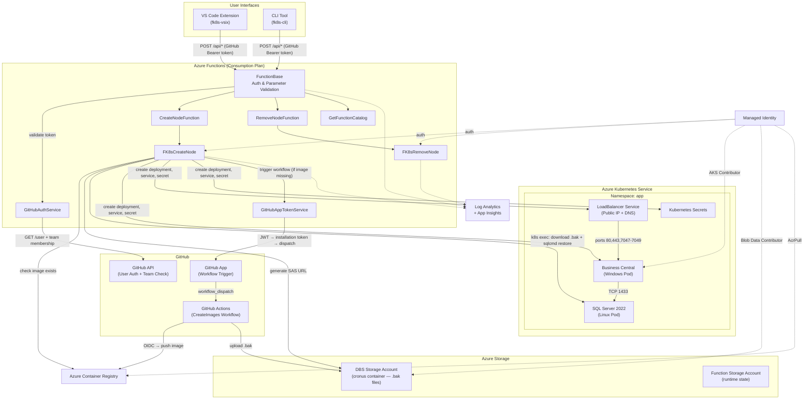
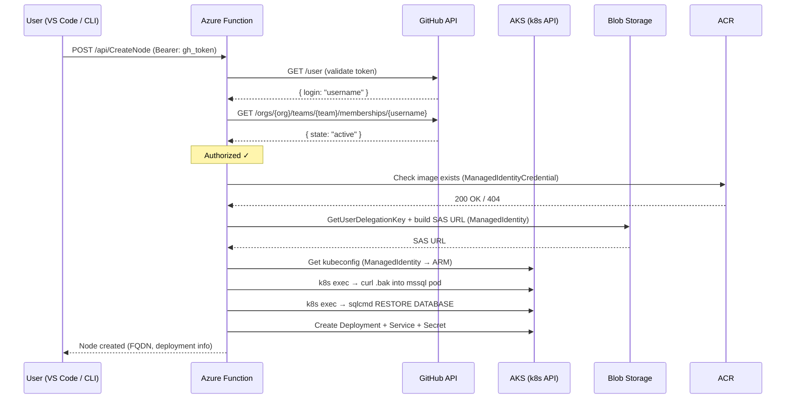

# FK8s Architecture

FK8s is a **GitHub-authenticated AKS node provisioner** that allows authorized GitHub team members to create on-demand Business Central environments on Azure Kubernetes Service — directly from VS Code or a CLI — without requiring Azure credentials.

## High-Level Overview

## Component Descriptions

### User Interfaces

| Component | Path | Description |
|-----------|------|-------------|
| **VS Code Extension** | `fk8s-vsix/` | Registers commands to create/remove nodes. Uses VS Code's built-in GitHub auth to obtain a Bearer token and calls the Function App API. Fetches the function catalog for dynamic parameter prompts. |
| **CLI Tool** | `fk8s-cli/` | Standalone .NET executable. Reads GitHub token from `GH_TOKEN`, `GITHUB_TOKEN`, or `gh auth token`. Interactively prompts for parameters with masked password input. |

### Azure Functions Backend

| Component | Path | Description |
|-----------|------|-------------|
| **FunctionBase** | `fk8s-functions/FunctionBase.cs` | Base class for all HTTP functions. Extracts Bearer token, validates it against GitHub API, checks team membership, parses and validates parameters against the function catalog, and injects the GitHub username. |
| **GitHubAuthService** | `fk8s-functions/Services/GitHubAuthService.cs` | Calls `GET /user` and `GET /orgs/{org}/teams/{team}/memberships/{username}` to authenticate and authorize requests. Allowed org/team pairs loaded from `ALLOWED_ORG_TEAMS` env var. |
| **GitHubAppTokenService** | `fk8s-functions/Services/GitHubAppTokenService.cs` | Creates JWTs signed with the GitHub App private key, exchanges for installation access tokens, and dispatches the `createImages` workflow when an image is missing from ACR. |
| **FK8sCreateNode** | `fk8s-functions/Services/FK8sCreateNode.cs` | Orchestrates node creation: ACR image check → database backup SAS URL → k8s exec to download and restore database → create K8s deployment, service, and secret. |
| **FK8sRemoveNode** | `fk8s-functions/Services/FK8sRemoveNode.cs` | Removes Kubernetes resources for a given node. |
| **FK8sServiceBase** | `fk8s-functions/Services/FK8sServiceBase.cs` | Shared base class with AKS/ACR/Storage config, Kubernetes client creation via managed identity, and k8s exec helpers (`FindMssqlPodAsync`, `ExecInMssqlPodAsync`). |

### Infrastructure (Terraform)

| Resource | File | Description |
|----------|------|-------------|
| **AKS Cluster** | `main.tf` | Linux system pool (1× D2s_v3) + Windows autoscale pool (0–10 nodes). Azure CNI overlay networking. |
| **Function App** | `function.tf` | Windows Consumption (Y1) plan. Isolated .NET 8 worker. All config injected via app settings. |
| **SQL Server** | `kubernetes.tf` | `mssql/server:2022-latest` on Linux pod with 128 Gi Premium SSD PVC. ClusterIP service on port 1433. Network policy restricts ingress to `app-type: windows-servicetier` pods. |
| **ACR** | `acr.tf` | Basic SKU. AKS kubelet identity gets `AcrPull`; GitHub Actions federated identity gets `AcrPush`. |
| **Managed Identity** | `identity.tf` | User-assigned identity with AKS Contributor + Storage Blob Data Contributor roles. Federated credential for GitHub Actions OIDC. |
| **Storage (DBS)** | `function.tf` | `fk8s{customer}dbs` — holds database backup blobs in a `cronus` container, keyed by image tag. |
| **Storage (Func)** | `function.tf` | `fk8s{customer}func` — Azure Functions runtime state (queues, tables). |
| **GitHub Team** | `github.tf` | Manages the authorized team within the GitHub organization. |
| **Monitoring** | `monitoring.tf` | Log Analytics workspace (30-day retention) + Application Insights for function telemetry. |

### GitHub Actions

| Workflow | Trigger | Description |
|----------|---------|-------------|
| **CreateImages** | `workflow_dispatch` (artifactUrls) | Downloads BC artifacts via `BcContainerHelper`, extracts and uploads the `.bak` database backup to blob storage, builds the container image with `New-BcImage`, and pushes to ACR. Authenticates to Azure via OIDC federated identity. |

## Authentication Flow

## Node Creation Flow

1. **Image check** — Verify the requested BC image exists in ACR. If missing, trigger the `createImages` GitHub Actions workflow via the GitHub App and return an error asking the user to retry.
2. **Database backup** — Generate a 1-hour read-only SAS URL for the `.bak` blob in the DBS storage account.
3. **Database existence check** — K8s exec into the mssql pod and run `sqlcmd` to verify the database doesn't already exist.
4. **Database restore** — K8s exec to `curl` the backup into the pod, then `sqlcmd` to `RESTORE DATABASE` with `MOVE` clauses for data/log files.
5. **Kubernetes resources** — Create a Secret (admin password), a Deployment (Windows pod with BC image and database env vars), and a LoadBalancer Service (public IP with Azure DNS label).
6. **Return** — FQDN (`{appName}.{region}.cloudapp.azure.com`), deployment name, and database name.

## Deployment

Infrastructure is provisioned via `terraform/deploy.ps1`, which:

1. Creates state storage (resource group + storage account + blob container)
2. Recovers secrets (SQL SA password, GitHub App key) from existing state or prompts
3. Runs a targeted bootstrap apply (AKS, storage, identity, function)
4. Runs a full `terraform apply` (Kubernetes resources, monitoring, GitHub)
5. Publishes the Azure Function code via `dotnet publish` + `az functionapp deployment`
6. Syncs GitHub Actions secrets (OIDC credentials, ACR login server, DBS storage account)
